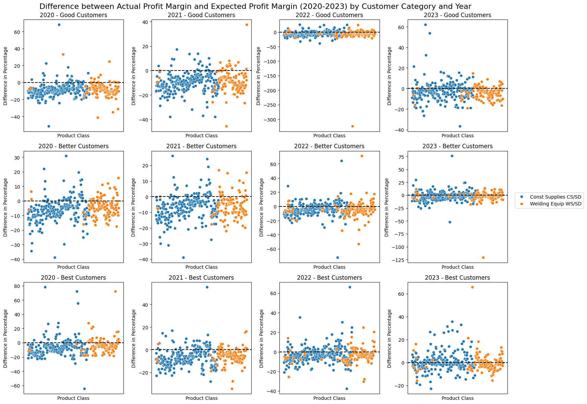

# Profit Margin Validation and Prediction with AMECO

## Table of Contents
1. [Overview](#Overview)

2. [Introduction](#Introduction)
   
   2.1 [AMECO](#AMECO)
   2.2 [Problem Statements](#Problem-Statements)
   2.3 [Project Goals](#Project-Goals)
   2.4 [Data](#Dataset)
       2.4.1 [Data Cleaning](#Data-Cleaning)
   
3. [Profit Margin Validation](#Profit-Margin-Validation)

   3.1 [Methods](#Validation-Methods)
   3.2 [Results](#Validation-Results)

5. [Profit Margin Prediction](#Profit-Margin-Prediction)

   4.1 [Methods](#Prediction-Methods)
       4.1.1 [Machine Learning Model](#Machine-Learning-Model)
       4.1.2 [Time Series Model](#Time-Series-Model)
   4.2 [Results](#Results)
       4.2.1 [Model Results](#Model_Results)
       4.2.1 [Model Comparison](#Model_Comparison)

7. [Conclusion](#Conclusion)

8. [Contributors](#Contributors)

## Overview 

Profit margins are an important metric in business. Our client, observing unexpected losses, asked us to help validate profit margins for their product lines. In this project, we used cleaned data from AMECO to first help validate differences between actual and expected profit margins. Then we used statistical tests to determine the statistical significance. Given the existence of differences between actual and expected profit margins, we then utilized Random Forest, ARIMAX, and Prophet models to predict the profit margins. We then compared such results and generated predictions of profit margin in 2024 for our client.

## Introduction 

In the business world, profit margin serves as a critical measure of both overall business efficacy and product performance. This metric is derived by employing the formula: (Revenue - Cost) / Cost. A higher profit margin typically signifies a stronger return on the entire business operation, and a high margin on a specific product indicates a substantial return on that particular item. Conversely, a lower profit margin suggests a less favorable return. Additionally, examining historical profit margins can offer valuable insights for future pricing strategies. For instance, should a product consistently yield a profit margin of 12%, any increase in costs may necessitate an adjustment in its selling price to maintain financial stability and profitability. Consequently, companies establish a general target profit margin for the company and specific profit margins for each product, setting prices accordingly based on cost and desired profit margin. In practice, however, salespersons may not always adhere strictly to these target profit margins. Factors such as market competition, customer bargaining power, and promotional strategies often influence the final selling price, implying a flexible and strategic approach to pricing. 

Credit To: <a href="https://www.investopedia.com/terms/p/profitmargin.asp">Investopedia</a>

 Our client, AMECO, a construction site services company, currently undergoing more losses than they expected, desires to examine whether the actual profit margin for each product class has met its target profit margin over the last four years. They also aim to understand how can they price better to gain more profits. 

### AMECO Background 

This Capstone project is in collaboration with AMECO, a construction site services company. It operates across different regions in the United States and primarily sells construction goods and welding equipment. Under these two major categories, each has hundereds of product lines. For instance, construction goods contain a product line called safety tools. Within each product line, there are dozens of products, for example, Hand Tools Plumb Bobs within the safety tools.

The pricing of each product is primarily determined by its target profit margins and customers' loyalty level. There are three customer's loyalty level, `Good`, `Better`, and `Best.` Each customer category has slightly different target profit margins with the `Best` customer category has the lowest profit margins, then `Better` customer category, and finally `Good` customers. Product prices are then determined based on the target.

### Problem Statements 

As salepersons might not strictly adhere to the selling price calculated by the target profit margins, AMECO wants to identify if there are significant magnitude of differences between the actual and target profit margins, and if these difference contributes to its profit margins to be overall lower. Additionally, they want to check if the current profit margins are optimal and reasonable to operate their business on. 

### Project Goals 

Based on the above problems, our project goals are two-fold. Our first goal is to validate their current profit margins. The idea is to find the profit margin for each product class and compare it with the corresponding target profit margin. After validating the current profit margins, if we find any differences, we want to find a reasonable profit margin for each product class. To achieve this, we intend to build a model for each product class to predict its profit margins and compare such with the target profit margins. Through these processes, we can help solve AMECO's concerns on their current profit margin performances and find better alternatives.

### Data 

Our original dataset spanning from 2016 to 2023 contains 1,155,850 rows and 45 fields. These 45 fields can be categorized into 3 major categories, including product information, pricing information, and other information. Wihtin product information, we have `product category`, `product class`, `specific item` names and all corresponding number identification, `date of transaction`, `stock status`. Within pricing information, we have `quantity`, `cost`, `customer categories`, and `prices`. We also have some available information about `geographics`, `buyer companies`, and `salespersons`.

The original dataset, however, has many missing information. AMECO underwent a system migration in 2019; as a result, the geographic data is missing prior to 2020. The dates of transaction prior to 2020 are coalesced into the 01-01. 

We also obtain two other datasets, one with more detailed client information with company and corresponding customer category, and the other one with target profit margins for each product class in 2023.

#### Data Cleaning 

1. Data Quality Check & Missing & Imputation

We first checked each column with missing information, and tried to come up with an imputation method to fill in those missing information. 

We examined the customer information, including `customer number`, `customer name`, and `customer category.` Initially we found the customer number and customer name were not one-on-one relationship, and then we enforced a consistent customer number format and stripped all additional punctuations from the customer name column. Then we paired these two fields and impute those with missing values. Finally we merged the updated customer category information from AMECO and obtained complete and quality data for `customer number`, `customer name`, and `customer category.`

We then examined the product information. Half of the product category and product class are missing in the original dataset, however, we did have complete product number information. As a result, we used the mode imputation because the product category only has two major categories and it will be straightforward and reasonable to fill in based on mode values. As for the product class we first tried to fill in missing information through pairing. We paired the item number with existing product class and category, and used this to infer information. For those that are still missing, we then used mode imputation.

Finally, we also filled in stock status information based on our client suggestions and used two complementary columns strikeforce flag and stock. The stock is the primary indicator and for those missing stock information, we used strikeforce flag to fill in stock status. The remaining ones are automatically deemed 'in-stock' because this is a more common case.

2. Data Fields Selection

Based on our project goals, we limited the time span from 2020 to 2023 to obtain valid and valuable data for analysis. Additionally, we utilized our client's domain knowledge to select out important fields, including `product category`, `product class`, `specific item`, `date of transaction`, `quantity`, `cost`, `customer categories`, and `prices` in our profit margin validation and prediction processes.

3. Data Manipulation

In the dataset, we have completed date information such as '2023-04-16' and we retrieved `Year` `Month` `Quarter` and `Previous Quarter` to prepare for date analysis.

We also marked AMECO's sub companies to boolean value and stored it to a column called `Own` because we believed the selling prices to sub companies are biased.

Finally, we also calculated the profit margin for each transaction. The formula is (price * quantity - cost * quantity)/price * quantity, here we can take out the quantity and calculated it as (price - cost)/price.

Eventually we created a new dataset 568,081 rows with 17 columns (`Customer Name`, `Product Category`, `Own`, `Year`, `Month`, `Quarter`, `Prev Quarter`, `Date`, `Group`, `Product Class`, `Specific Item`, `Quantity`, `Cost`, `Price`, `State`, `Stock`,`Profit Margin`)

This table randomly sampled 10 rows for demonstration purpose. 

## Profit Margin Validation 

The primary goal of AMECO is to validate its current pricing model. The current pricing model predicts a target profit margin for each product class and customer category. Then the salesperson will use the target margin as a reference to set a final price based on a variety of factors including the customer loyalty, quantity, etc. We want to examine whether each product class’ actual profit margin meets the target profit margin in each customer category.
Profit Margin = Profit / Revenue * 100%
It represents the proportion of revenue that is earned by the company.

### Methods 

To validate whether each product class’ actual profit margin meets the corresponding profit margin in each customer category, we take two steps: exploratory data analysis and statistical tests.
For each transaction row, we calculate the profit margin based on (price-cost)/price since the quantity will be canceled out from our formula. Then we took the median of each product class in different years. We took the median instead of the average or the ratio between total profit and total revenue because we did not want those extreme values to dominate the actual margins. 
1. Exploratory Data Analysis
In exploratory data analysis, we aim at using graphs to let a non-technical audience detect trends in profit margins across different product classes and customer categories, identify any outliers or anomalies in the data, and understand the distribution and variability of profit margins within each category. This visual approach helps to quickly grasp the overall performance and spot areas that may require further investigation or adjustment in the pricing strategy.
We used a series of scatter plots to illustrate the profit margin trends. The x-axis represents the product class. Because there are hundreds of product classes under each product category and we are interested in the general trend, the name of each product class is not included. (We plan to make an interactive plot that shows the class name when the cursor moves over a point in the scatter plot.) The y-axis represents the difference between the actual margin and target margin, which is expected to be equal or larger than zero to maximize profitability. The scatter plots are plotted from 2020 to 2023 for each customer category. We can then visualize the trend changes across the past four years and different performances among customer categories. The main idea of generating these scatter plots is to validate the actual and target profit margins and observe the patterns and trends of changes in profit margins.
2. Statistical Tests
To further investigate the patterns observed in the exploratory data analysis, we will use statistical tests to determine the statistical significance of the differences between actual and target profit margins across different product classes and customer categories, as well as to analyze the trends over the four-year period.
In particular, we used paired t-tests to compare the mean difference between the actual and target profit margins for each customer category and product category in each year. This test helps us assess whether the observed differences in profit margins are statistically significant and not just due to random chance. By pairing the actual and target margins for each class and category, we can directly examine whether the actual margins consistently meet, exceed, or fall short of the targets, providing a clear statistical insight into the effectiveness of the pricing strategy over the studied period.

### Results 
1. Scatter plots analysis
From the scatter plots, we can find there exists some outliers with extremely high (eg. 60%) or extremely low (eg. -300%) differences. Moreover, most points are clustered below zero line, which means most product classes cannot achieve the target profit margins.
The next step is to zoom into the range where most points are located. After we set the range to be [-25, 25] as suggested by our client, we generated a new graph to visualize the trend over the past four years and across different customer categories.

When comparing scatter plots sequentially from left to right, we observe a clear trend of data points becoming increasingly clustered around zero. This clustering indicates that more product classes are hitting their target margins as time progresses. Furthermore, the degree of clustering varies by customer category: 'best' customers show the most significant improvement, with points most densely packed around zero, suggesting a strong alignment with target margins. In contrast, 'good' customers exhibit the least clustering, indicating a relatively weaker performance in achieving target margins. In summary, the trend over time reveals that a higher number of product classes are meeting their target margins, with the 'best' customer category showing the most substantial improvement, while the 'good' customer category lags behind.

2. Paired t-test
Examining the p-value table for construction supplies items reveals a gentle upward trend in p-values from 2020 to 2022, followed by a significant surge from 2022 to 2023. Higher p-values suggest diminishing evidence against the null hypothesis, which posits no difference between actual and target margins. Consequently, the gradual increase through 2020 to 2022 and the marked rise in 2023 suggest an overall trend of more product classes meeting their target margins, with 2023 showcasing notable improvement. Specifically, the p-values for 2023 highlight that 'best' customers are closely aligned with target margins, demonstrating strong performance. Conversely, 'good' customers exhibit relatively weaker performance in reaching target margins, as inferred from their lower p-values. 

After we set the range to be [-25, 25] as suggested by our client, we generated a new graph to visualize the trend over past four years and across different customer categories.

## Profit Margin Prediction 

### Methods 
The profit margin prediction for AMECO was executed using two primary modeling approaches to address the unique challenges of the dataset.

#### Machine Learning Model 
We implemented several machine learning models, and Random Forest has the best performance with relatively low RMSE about 6.97, known for its strong performance in capturing non-linear interactions within complex datasets. The model was trained on variables that included temporal aspects like the month and customer categories, to predict profit margins for hundreds of AMECO’s product classes.

#### Time Series Model 
Through rigorous exploratory data analysis, our models detected a seasonal pattern peaking between July and September, as well as a positive shift post-pandemic. So, we decided to implement time series models to predict more realistic profit margins. Our time series analysis employed two models, ARIMAX and Prophet. For ARIMAX, it takes advantage of its capacity to capture both stationary and non-stationary trends, and external categorical variables into the forecast. This model allowed us to extend our predictions by considering the influence of time-dependent trends and customer segmentation on profit margins. The RMSE for ARIMAX is 8.99. For Prophet, developed by Google, it is sensitive to seasonal patterns and events, like Christmas and accidental events, and robust to shifts in the trend. It turns out that the RMSE for ARIMAX is 8.99.

### Results 

#### Model Results 

#### Model Comparison 

Results for Different Product Classes

While the RMSE detailed in 4.1.2 reflects an average measure across all product classes, our investigation revealed significant variation in performance between different categories. For instance, the 'Safety Tools' category showed a notably precise RMSE of 1.63, indicating a high level of accuracy in our forecasts for this class. The forecasts closely followed the observed data points, and the confidence intervals were consistently tight, reflecting the model's confidence in its predictions.

Conversely, the 'Abrasive Miscellaneous' category presented a substantially higher RMSE of 18.56, suggesting greater variability in predictive accuracy for this class. The observed data points displayed a wide spread around the forecast line, and the broader confidence intervals indicated a higher level of uncertainty in the model's predictions.

## Conclusion 

In conclusion, we used visualization to identify pattern changes in the differences between actual and target profit margins, and statistical test to confirm the significance of such differences. As for profit margin predictions, we discovered the Random Forest to be the best performing model. This finding is in contrast of the time series nature of our data. However, we believe it is due to the complexities of product lines. While time series model performs well in some product lines, it performs relatively worse in other product lines. As a result, we believe we can use a combination of the Random Forest, Prophet, and ARIMAX to help our client find the optimal profit margins for each product.
